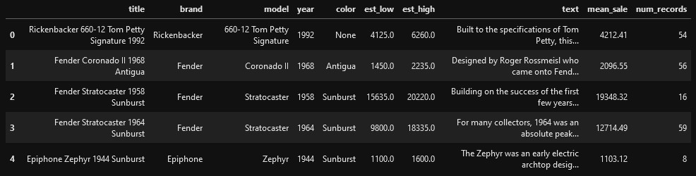
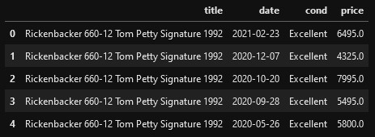

Used instruments are the lifeblood of small music retailers. Even titans like Guitar Center and Sweetwater gladly engage in the thriving used guitar market. During my years working in music retail, I cumulatively spent many hours researching used instruments - especially guitars - for customers to ensure that I could offer a fair price and, if purchased, ask a fair price for an instrument once it was put on display. A tool to help make this process a bit faster would have been great!  

# Data

[Reverb.com](https://reverb.com) is a popular online marketplace for buying, selling and trading music equipment. Using Selenium, Beautiful Soup and MongoDB, I gathered my data set from their [electric guitar price guide](https://reverb.com/price-guide/electric-guitars). Reverb's price guides include anonymized sales records for 2900+ electric guitars from 100+ brand names, which are composed of a sale date, a Poor to Mint condition rating and a sale price for each guitar by brand, model, year and color. After some cleaning and filtering, the data set contains 140,000+ individual sales records.

# Methods

# Results

# Future Steps
